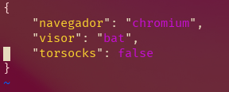

# KPA: KevinCrrl Python Aur helper

Este es un proyecto simple para automatizar la clonación de PKGBUILD y construcción a pertir de ellos usando el AUR (Arch User Repository), ya que la forma clásica de instalar paquetes desde el AUR es de manera manual, sin embargo ya que suele ser un proceso complejo, se crean estos programas, sin embargo, un helper puede ser riesgoso ya que ejecuta el PKGBUILD sin intervención humana, además que puede ocultar las salidas o incluso reemplazar herramientas clásicas como makepkg, pues en los PKGBUILD pueden haber comandos maliciosos que se pueden ejecutar pidiendo permisos root al usuario, además que rompe la actividad clásica de usar las herramientas propias del sistema Arch Linux.

## Diferencias de este AUR helper

- kpa automatiza y muestra las salidas de las herramientas propias de Arch, el entorno Linux y el control de versiones.

- Tiene varios comandos simples:

-I: Instalar
-A: Actualizar
-D: Desinstalar
-C: Consultar información en un navegador
-R: Reinstalar

Puede ejecutar kpa -h para obtener más información.

- Confirmación del usuario: Antes de usar makepkg, se le muestra al usuario el PKGBUILD para que lo pueda leer y decidir dentro de la interfaz de consola del programa si quiere continuar o cancelar.

- Python puro: kpa sigue una filosofía minimalista, por ello no usa bases de datos del AUR, controles de versiones innecesarioso configuraciones que no tienen que ver con la libertad con el usuario, kpa solo sigue su objetivo de automatizar y ser útil, por ello usa sus propias carpetas para almacenar los repositorios del AUR clonados, para poder recorrerlos en actualizaciones, verificar su existencia y comparar PKGBUILDs, además de su propia forma de configuración liviana en JSON para darle libertad al usuario sobre como quiere usar su AUR helper sin comprometer peso o portabilidad del programa.

- Sin tantas dependencias: kpa depende de las librerías propias de Python y la libreía externa colorama, lo cual no debe ser un gran peso, ya que Python viene instalado en la mayorpia de sistemas Linux, y python-colorama está en el extra de Pacman, por último para la automatización solo se usan programas que forman parte de las coreutils de GNU que vienen en toda instalación de Arch (como rm, mv y cat, que son usadas en kpa), además se usa solo lo suficiente para la construcción de paquetes del AUR, o sea, Git y makepkg que según la Wiki de Arch ya viene por defecto en el paquete Pacman. Además si se descarga la versión ya compilada desde la zona de releases o desde el AUR, no se necesitará tener ni Python ni python-colorama.

## Ejemplo de ~/aur/kpa.json

Este archivo permite a KPA saber que programas usar para ver y mostrar (e incluso editar si se escoge un editor) PKGBUILDs, esto mediante la variable "visor" donde se pueden usar visores de consola como cat o bat, e incluso editores para hacer personalizaciones al PKGBUILD como nano o vim y la variable "navegador" se usa para abrir la página de un paquete en el AUR cuando se use el argumento -C, si alguna de estas variables no está definidas o no está instalada realmente, KPA lanzará una advertencia, es importante tener este archivo y editarlo correctamente, por ello se proporciona este ejemplo:

